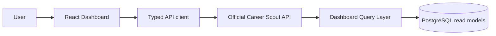

# Career Scout Dashboard

Career Scout Dashboard is the daily-use web interface for reviewing opportunities discovered and evaluated by Career Scout. It turns the official Career Scout API into a focused workflow for deciding where to apply, understanding recommendation evidence, opening the original LinkedIn posting, and reviewing previous collection campaigns.

> Project status: first official development baseline (`0.1.0`).

## Product goal

The Dashboard is designed to answer three practical questions:

1. Which opportunities has Career Scout found?
2. Which opportunities should receive attention or an application?
3. What evidence supports each recommendation?

The current product intentionally prioritizes this daily workflow over advanced agent analytics.

## Main features

- **Opportunity Inbox** — browse, search, filter, and prioritize discovered opportunities.
- **Opportunity Details** — inspect match score, recommendation reason, matched skills, missing skills, and the original job description.
- **LinkedIn access** — open the source posting directly from the Inbox or Details page.
- **Campaign History** — review previous Career Scout campaigns, execution status, volume, ranking, and application metrics.
- **Honest data states** — distinguish evaluated recommendations from opportunities that have only been discovered.
- **Responsive navigation** — use the core workflow on desktop and smaller screens.

## Application routes

| Route | Purpose |
| --- | --- |
| `/` | Opportunity Inbox |
| `/opportunities/:opportunityId` | Opportunity Details |
| `/campaigns` | Campaign History |

## Architecture



The Dashboard is a client-only React application. It does not access Career Scout databases, repositories, output files, or internal services directly. All product data comes from the official read-only API.

### Data flow

1. Pages request typed data through `src/lib/api.ts`.
2. The API client calls official endpoints under `/api`.
3. Career Scout serves stable Dashboard read models.
4. Pages present available evidence without inventing recommendations for incomplete campaigns.

## Technology stack

| Area | Technology |
| --- | --- |
| UI | React 18 |
| Language | TypeScript 5 |
| Routing | React Router 6 |
| Styling | Tailwind CSS 3 |
| Build tooling | Vite 5 |
| API transport | Browser Fetch API |
| Package manager | npm |

## Project structure

```text
career-scout-dashboard/
├── docs/
│   └── screenshots/        # Reserved product screenshots
├── src/
│   ├── components/         # Shared presentation and navigation components
│   ├── layouts/            # Application shell
│   ├── lib/
│   │   └── api.ts          # Official Career Scout API contract and client
│   ├── pages/              # Route-level product screens
│   ├── App.tsx             # Active routes
│   ├── main.tsx            # React bootstrap
│   └── styles.css          # Tailwind layers and design tokens
├── index.html
├── package.json
├── tailwind.config.cjs
├── tsconfig.json
└── vite.config.ts
```

## Career Scout integration

Career Scout is responsible for collecting opportunities, ranking matches, recording recommendation evidence, and persisting campaign history. The Dashboard is responsible only for presenting those existing read models.

The UI currently consumes:

| Endpoint | Dashboard use |
| --- | --- |
| `GET /api/opportunities` | Inbox, search, filtering, sorting, and pagination |
| `GET /api/opportunities/{id}` | Opportunity metadata and latest recommendation |
| `GET /api/opportunities/{id}/history` | Latest available ranking and decision evidence |
| `GET /api/campaigns` | Campaign History and campaign metrics |
| `GET /health` | API availability during local verification |

Recommendation evidence is read from the official opportunity recommendation snapshot. If a campaign has not produced a ranking or decision, the UI reports the opportunity as not evaluated.

## Local development

### Prerequisites

- Node.js 18 or newer
- npm
- A running Career Scout API
- Career Scout's PostgreSQL database and Dashboard Query Layer configured by the API project

### Install dependencies

```bash
npm ci
```

### Start the Career Scout API

From the Career Scout backend repository:

```powershell
.\.venv\Scripts\python.exe -B -m uvicorn src.api.app:app `
  --host 127.0.0.1 `
  --port 8000
```

API documentation will be available at `http://127.0.0.1:8000/docs`.

### Start the Dashboard

```bash
npm run dev
```

Open `http://localhost:5173`.

During development, Vite proxies `/api` and `/health` to `http://127.0.0.1:8000`.

## Environment configuration

The local proxy requires no Dashboard environment file. To use a different API origin, create `.env.local`:

```dotenv
VITE_CAREER_SCOUT_API_URL=https://career-scout-api.example.com
```

| Variable | Required | Description |
| --- | --- | --- |
| `VITE_CAREER_SCOUT_API_URL` | No | Career Scout API origin. Defaults to the Dashboard origin and uses the Vite proxy locally. |

Do not commit `.env` or `.env.local`. Production deployments must either serve the Dashboard and API from the same origin or configure CORS in the API for the Dashboard origin.

## Available commands

| Command | Description |
| --- | --- |
| `npm run dev` | Start the Vite development server |
| `npm run build` | Create a production bundle with Vite |
| `npm run preview` | Preview the production bundle locally |
| `npx tsc --noEmit` | Run a standalone TypeScript validation |

The repository does not yet define an automated test suite. Build and TypeScript validation are the current regression gates.

## Screenshots

Screenshot locations are reserved for the first visual release:

| Screen | Reserved path |
| --- | --- |
| Opportunity Inbox | `docs/screenshots/opportunity-inbox.png` |
| Opportunity Details | `docs/screenshots/opportunity-details.png` |
| Campaign History | `docs/screenshots/campaign-history.png` |

## Roadmap

The next product phases may include:

- opportunity feedback and lifecycle actions;
- richer campaign drill-down;
- Decision Compare backed by structured API data;
- capability and skills-gap analysis;
- agent reasoning and reflection history;
- automated unit, integration, and browser tests;
- production authentication, observability, and deployment documentation.

These items are intentionally outside the first official baseline.

## Author

Created and maintained by [Maicon Fang](https://github.com/maiconfang).

## License

No open-source license has been selected for this repository. All rights reserved unless a license file is added in a future release.
